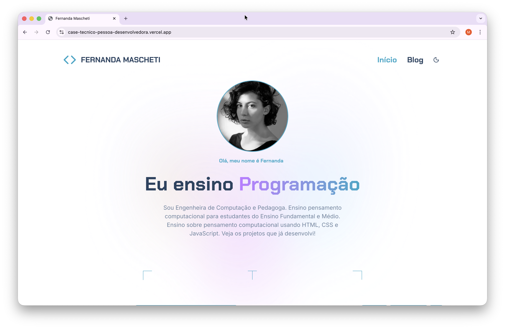

Este repositório contém a solução para o desafio técnico de Pessoa Desenvolvedora Frontend da Alura. 

A aplicação consome uma API fake fornecida pela Alura para exibir posts, implementar filtros, paginação e uma página de detalhes para cada post.

[Produção](https://case-tecnico-pessoa-desenvolvedora.vercel.app/)

## ✨ Funcionalidades Implementadas

Seguindo os requisitos do desafio, a aplicação conta com as seguintes features:

### Página Inicial (Listagem de Posts):
- Exibição dinâmica dos posts consumidos da API.
- Paginação configurada para exibir 6 posts por página.

### Sistema de Filtros:
- Busca por palavra-chave (implementada com **Fuse.js** para uma busca client-side eficiente).
- Filtro por categorias (consumindo os endpoints da API).

### Página de Detalhes da Postagem:
- Rota dinâmica.
- Seção de "Postagens Relacionadas" (lógica de sugestão baseada em categorias ou tags).

### Design e UX:
- Layout 100% responsivo (desktop, tablet e mobile).
- Componentização reutilizável.

### Boas Práticas:
- **SEO**: Uso de meta tags dinâmicas, title e description adequados para cada página, garantindo boa indexação.
- **Acessibilidade (a11y)**: Implementação de semântica HTML correta, atributos ARIA e contraste de cores.


### Bônus (Diferencial):
- Implementação de Tema Dark/Light com toggle no header, persistindo a preferência do usuário.

## 🛠️ Tecnologias Utilizadas

O projeto foi construído utilizando o que há de mais moderno no ecossistema frontend, conforme solicitado no desafio:

### Core:
- **Next.js 15** (utilizando o App Router)
- **TypeScript** (com foco em tipagem segura e interfaces)

### Estilização:
- **Tailwind 4** (configurado com postcss)
- **lucide-react** (para iconografia)

### Busca e Filtro:
- **Fuse.js** (para a implementação da barra de pesquisa com fuzzy search)

### Qualidade de Código:
- **ESLint** (configurado com as regras do Next.js)
- **Husky & Commitlint** (para garantir o padrão de Conventional Commits antes de cada push)

## 🚀 Rodando o Projeto

Para executar este projeto localmente, siga os passos abaixo:

1.  **Clone o repositório:**
    ```bash
    git clone [https://github.com/seu-usuario/case-tecnico-pessoa-desenvolvedora-frontend-nextjs.git](https://github.com/seu-usuario/case-tecnico-pessoa-desenvolvedora-frontend-nextjs.git)
    cd case-tecnico-pessoa-desenvolvedora-frontend-nextjs
    ```

2.  **Instale as dependências:**
    *(Eu utilizei `npm` para gerenciar os pacotes, como visto no `package-lock.json`)*
    ```bash
    npm install
    ```

3.  **Execute o servidor de desenvolvimento:**
    ```bash
    npm run dev
    ```
   

A aplicação estará disponível em [http://localhost:3000](http://localhost:3000).

### Outros Scripts

* **Build de Produção:**
    ```bash
    npm run build
    ```
   
* **Iniciar servidor de produção local:**
    ```bash
    npm run start
    ```
   
* **Executar o Linter:**
    ```bash
    npm run lint
    ```

## Preview 



  
